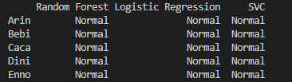

Repositori ini berisi pengerjaan untuk soal [ujian machine learning JCDS04](https://github.com/LintangWisesa/Ujian_MachineLearning_JCDS04) nomor 1.

Berdasarkan dataset yang diberikan dibuat 3 model machine learning untuk memprediksi kesuburan seseorang dengan profil tertentu.

Output pada terminal berupa perbandingan hasil prediksi ketiga model machine learning tersebut.

